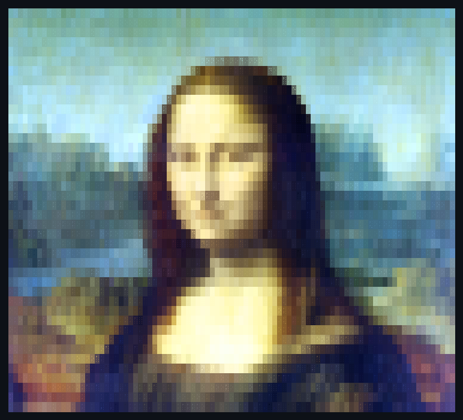
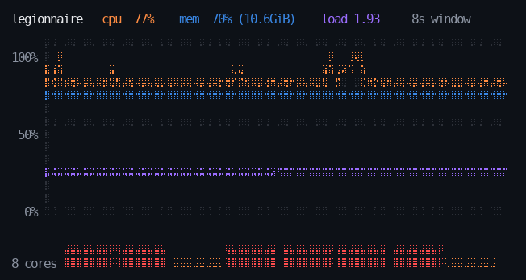

# braillecanvas

A braille framebuffer for the terminal, with 24-bit colour and labels that refuse to overlap.

Unicode braille addresses **2×4 dots per character cell**, so an 80×24 terminal is really a
160×96 canvas. That's what separates a rendering from ASCII art.

```
⠄ sin ⠄⣀⡤⠤⠤⣀⠄ ⠄ ⠄ ⠄ ⠄ ⠄ ⠄ ⠄ ⠄ ⠄ ⠄ ⠄ ⠄ ⠄ ⠄ ⠄ ⠄⣀⠤⠤⠤⣀⠄ ⠄ ⠄ ⠄ ⠄ ⠄ ⠄ ⠄ ⠄ ⠄ ⠄
     ⡠⠊     ⠉⠢⡀                           ⢀⠔⠉     ⠑⢄
⠉⠑⢄⡠⠊         ⠈⠢   ⢀⠔⠉⠉⠑⢄                ⣐⠕⠉⠉⠒⢄     ⠑⢄         ⢀⠔⠉⠉⠒⢄
  ⠔⠡⡀           ⠑⡀⡐⠁     ⠡⡀            ⢀⡚⠁     ⠡⡀     ⠢⡀      ⡐⠁     ⠡⡀
⢀⠊  ⠐⠄           ⠜⢂       ⠐⠄          ⡠⠕        ⠐⠄     ⠐⠄    ⠔        ⠐⠄
⠉⠉⠉⠉⠉⠉⢍⠉⠉⠉⠉⠉⠉⠉⠉⢉⠍⠉⠉⠩⡉⠉⠉⠉⠉⠉⠉⠉⢍⠉⠉⠉⠉⠉⠉⠉⠉⢝⠍⠉⠉⠉⠉⠉⠉⠉⠉⠉⠉⠉⢍⠉⠉⠉⠉⠉⠉⢋⠉⢉⠍⠉⠉⠉⠉⠉⠉⠉⠉⠉⠉⠉
       ⠢      ⠠⠂    ⠐⠄       ⢂     ⠠⠪⠂             ⢂      ⠡⡂    cos
```

## Install

```bash
npm install braillecanvas
```

## Use

```js
import {Canvas} from 'braillecanvas';

const c = new Canvas(72, 10);              // terminal columns, rows
c.line(0, 20, 143, 20);                    // dot coordinates: 2x the cols, 4x the rows

for (let x = 0; x < 144; x++)
    c.set(x, 20 - Math.round(18 * Math.sin(x / 12)), 0x3987e5, 2);

c.tryText(2, 0, 'sin', 0x3987e5);          // cell coordinates
console.log(c.toString());
```

## Example: an image, dithered

`examples/image.js` renders a picture as braille. A 110×65 terminal is a **220×260 bitmap** —
enough for a recognisable face.



```bash
# any format -> PPM (the example has no dependencies, and Node can't decode JPEG)
python3 -c "from PIL import Image; Image.open('in.jpg').save('out.ppm')"

node examples/image.js out.ppm --cols 110 --ordered
node examples/image.js out.ppm --cols 60 --mono --ordered
```

**Use `--ordered` for anything small.** The default is Floyd–Steinberg error diffusion, which
is right for large photographic renders but works against you here: it preserves *local
average* tone by scattering error, so every region lands near its own mean and the whole
picture reads as uniform texture. Ordered (Bayer) dithering uses a fixed threshold pattern, so
equal tones always produce the same dot arrangement — the eye reads that regularity as a
distinct shade rather than as noise. The difference between an unreadable smudge and the
picture above was that one flag.

Do **not** pre-boost contrast or gamma. It is tempting — a 1-bit grid needs contrast — but
with two colours per cell the tone is carried by colour, not dot density, and a boosted curve
just crushes cells to all-dots-or-none. Measured on the Mona Lisa at 93 columns: contrast 1.8
plus gamma 2.2 left **32%** of cells with 0 or 8 dots lit (flat, textureless), against **3.4%**
for a plain autocontrast. Straight autocontrast also keeps the colours the painting actually has.

Colour is applied per cell, and each cell carries **two** of them: a foreground for the lit
dots and a background for the gaps, so a cell straddling an edge — skin against sky — keeps
the edge instead of averaging it into mud. Measured on this image: mean per-dot colour error
falls from 45.7 to 21.3, a 53% improvement.

## Example: a live server monitor

`examples/monitor.js` plots real `/proc` data — CPU, memory and load average over a rolling
window, with a per-core bar strip along the bottom. It is 78×20 cells, which is a **156×80 dot
framebuffer**.



```bash
node examples/monitor.js                    # ~20s, then exits
node examples/monitor.js --frames 500 --interval 250
node examples/monitor.js --no-colour        # pipe-friendly
```

It exercises the three things below in one picture: the gridlines are drawn at weight 0 so a
trace crossing them keeps its colour, the labels are placed with `tryText` so a crowded chart
drops a label rather than clipping one, and the traces resolve to a quarter of a character
cell.

## What it does that a plain dot canvas doesn't

Most braille canvases set and clear dots. The two things that turn that into something you can
actually put a chart in:

**Colour, arbitrated.** A cell holds eight dots but takes **one** foreground colour, so when
several marks share a cell one has to win. `set(x, y, rgb, weight)` lets the heavier mark keep
the colour — pass a magnitude, a z-depth, an importance, whatever ranks your marks. Blending
would turn a dense cluster grey, and the eye does the same thing anyway.

**Labels that decline rather than clip.** `tryText` places a label only if the space is free and
returns whether it went in, so callers place in priority order and whatever doesn't fit is
simply not drawn — which is what a cartographer would do. It also flips to the other side of its
anchor at the frame edge, so you never get `Saturn` rendered as `Sat`.

## API

| | |
|---|---|
| `new Canvas(cols, rows, {aspect})` | `aspect` is dot height/width; 1.0 is square |
| `set(x, y, rgb?, weight?)` | light one dot (dot coords) |
| `setCellBackground(col, row, rgb)` | paint a cell's background (cell coords) |
| `line(x0, y0, x1, y1, rgb?, weight?)` | Bresenham |
| `dottedLine(..., step = 2)` | every `step`-th dot |
| `text(col, row, str, rgb?)` | unconditional, cell coords |
| `tryText(col, row, str, rgb?, {pad})` | places only if free; returns `boolean` |
| `clear()` | dots, colours and labels |
| `toString({colour, background})` | ANSI; `background` defaults to `null` (inherit) |

**Coordinates:** `set`/`line` take *dot* coordinates (`canvas.width` = `cols*2`,
`canvas.height` = `rows*4`). `text`/`tryText` take *cell* coordinates, because glyphs can't live
on the dot grid.

## Two things worth knowing

**The dots are very nearly square**, which is easy to assume otherwise. A character cell is
about 1:2; two columns and four rows gives spacing of w/2 and h/4 = w/2. Measured in Ubuntu Mono
11: cell 8.00 × 17px, so dots are 4.00 × 4.25px — an aspect of 1.062. `aspect` corrects that
residual 6% by scaling y about the origin, so a circle drawn with `aspect: 1.062` comes out
round rather than 6% flat. Ignore it and shapes are slightly squat, not unrecognisable.

**Out-of-range coordinates light nothing.** `NaN`, `undefined` and negative fractions are all
rejected rather than clamped — a projection returns `NaN` for a point behind the viewer, and
silently plotting that in the corner is worse than dropping it.

**Dotted guide lines are not cosmetic.** Scaffolding competes with the data it points at, and on
a dense canvas it wins, which is backwards. A worked example: on a 100×28 terminal, solid figures
for 89 constellations put 545 lit dots of line against 186 of star — 2.9:1. A step of 3 brings it
to about 1.1:1, which finally puts more ink into the subject than the guides.

## Used by

- [starwheel](https://github.com/igfray/starwheel) — a live planisphere in your terminal
- [terrafirma](https://github.com/igfray/terrafirma) — a real sky as your GNOME wallpaper

Extracted from those, so the awkward parts — colour arbitration, label collision, NaN
coordinates from a projection — are ones it has already hit.

## Licence

MIT.
